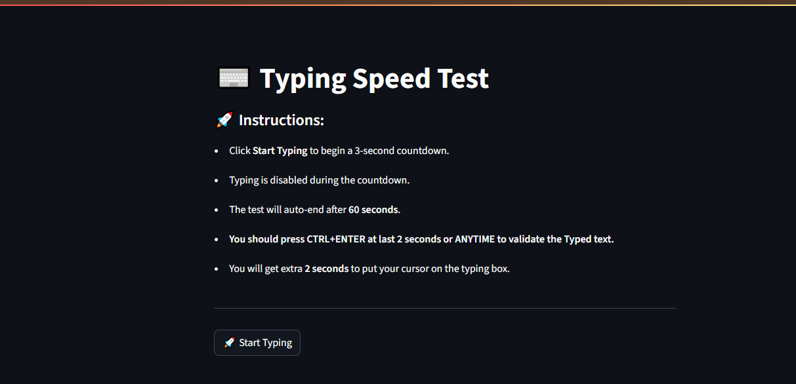
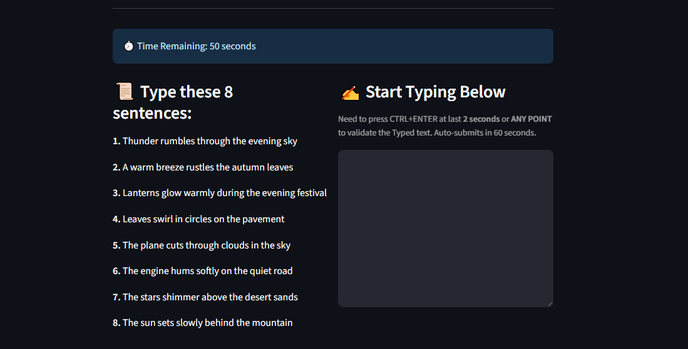
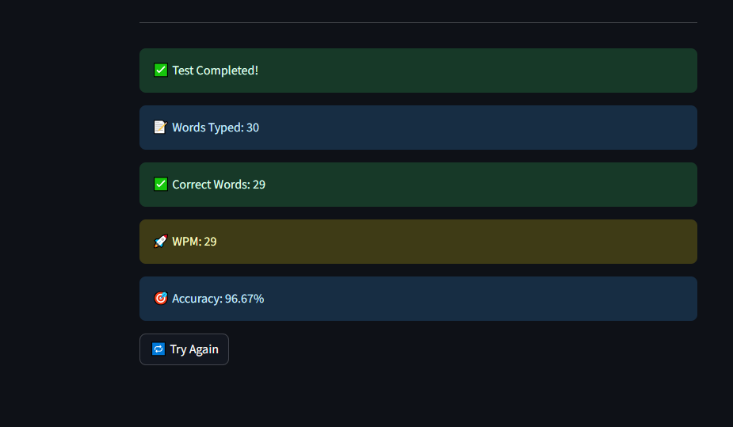

# ⌨️ Typing Speed Test Web App

A simple and interactive typing speed test built using **Streamlit**. This app challenges users to type a set of randomly selected sentences within a 60-second timer and evaluates **WPM (Words Per Minute)** and **accuracy** in real-time.

## 🚀 Features

- 🔁 Auto-refresh logic for real-time countdown and session updates.
- ⏱️ 3-second preparation countdown before typing starts.
- 🧠 8 randomly picked sentences for each test session.
- ✍️ Typing area and sentence prompt displayed **side-by-side**.
- ⌛ Test auto-submits after 60 seconds and you need to press **CTRL+ENTER**.
- 📊 Real-time evaluation of:
  - Total typed words
  - Correct words
  - WPM (Words Per Minute)
  - Accuracy percentage

---

## 🖼️ Demo Preview

## 🛠️ Tech Stack

- **Python**
- **Streamlit**
- `streamlit_autorefresh` (for managing auto-refresh during countdowns)

---
